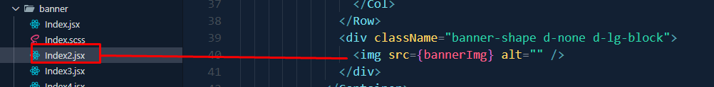
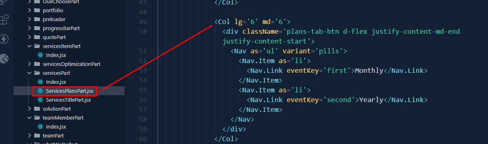

# Omnivus

Omnivus is a cutting-edge Next.js application designed for **IT solutions, digital services, and business agencies**. This project is fully responsive, feature-packed, and customizable for any modern IT-related business.

---

### ⚙️ Requirements

To install and set up this template properly, ensure your system has **Node.js** installed, and you are using **Yarn** for managing dependencies.

---

### 🚀 Quick Start Guide

To begin, install the required dependencies using the following command:

```bash
yarn install
```

After installation, start the development server with:

```bash
yarn dev
```

Navigate to [http://localhost:3000/](http://localhost:3000/). The app will automatically reload when you change any source files.

---

### 📦 What's Included

After purchasing the **Omnivus** template on Themeforest, download the package. Extract the files to access:

- **Omnivus Template**: An installable Next.js template zip file.
- **Documentation Folder**: Contains this documentation you are reading now.

Here’s an overview of the included files:

  


---

### ⚛️ Next.js Installation

To set up locally, follow these steps:

1. Open your terminal or command prompt.  
2. Navigate to the project folder.  
3. Run the following commands:

   ```bash
   yarn install
   yarn dev
   ```

---

### 🛠️ Customization

### Change Site Title and Favicon

To change the site title, open the project in your editor and edit the `next.config.js` file or use the `Head` component in the pages where needed:


To update the favicon, replace the `favicon.ico` file in the `public/` directory as shown:


---

### Home 1 Customization

For **Home 1**, you can customize the following sections:

- **Banner Image**: Modify `_banner.scss` located in `styles/`.

  

- **Services Section**: Edit `Index.jsx` in `components/LatestServicesPart/`.

  

- **Team Member Section**: Edit `Index.jsx` in `components/teamMemberPart/`.

  

- **Latest News Section**: Edit `Index.jsx` in `components/latestNewsPart/`.

  

---

### Home 2 Customization

For **Home 2**, you can modify:

- **Banner Image**: Edit `Index2.jsx` in `components/banner/`.

  

- **Services Section**: Edit `Index.jsx` in `components/whatWeDoPart/`.

  

- **FAQ Section**: Edit `Index.jsx` in `components/answersPart/`.

  

- **Latest News Section**: Edit `Index.jsx` in `components/latestNewsPart/`.

  

---

### Service Page

On the **Service Page**, you can customize:

- **Service Item Section**: Edit `Index.jsx` in `components/servicesItemPart/`.

  

- **Service Plans Section**: Edit `ServicesPlansPart.jsx` in `components/servicesPart/`.

  

---

### Case Study Page

To edit the **Case Study Page**, update `index.jsx` located in `pages/case-study/`.


---

### 🏗️ Build for Production

To build the project for production, use:

```bash
yarn build
```

---


### 📧 Support

If you enjoy using our product, [Please Rate Us](https://themeforest.net/user/ducor). 😊
