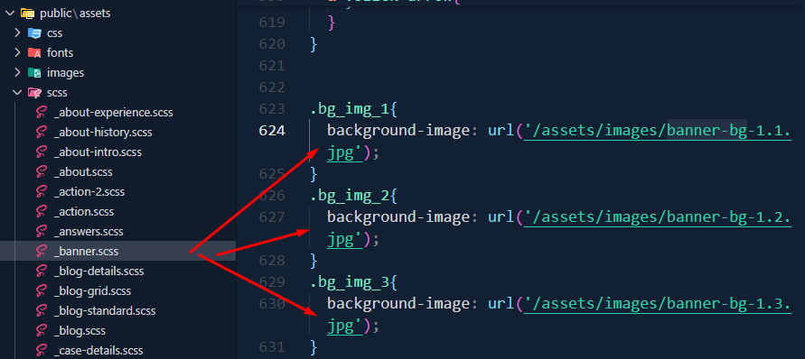
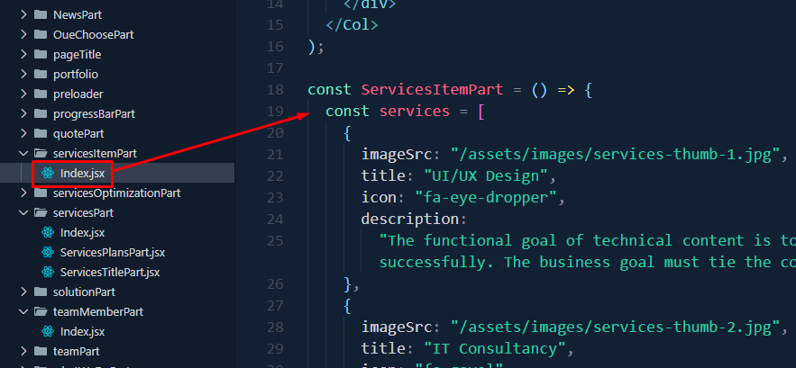

# Omnivus

Omnivus is a cutting-edge Next.js application designed for **IT solutions, digital services, and business agencies**. This project is fully responsive, feature-packed, and customizable for any modern IT-related business.

---

### ⚙️ Requirements

To install and set up this template properly, ensure your system has **Node.js** installed, and you are using **Yarn** for managing dependencies.

---

### 🚀 Quick Start Guide

To begin, install the required dependencies using the following command:

```bash
yarn install
```

After installation, start the development server with:

```bash
yarn dev
```

Navigate to [http://localhost:3000/](http://localhost:3000/). The app will automatically reload when you change any source files.

---

### 📦 What's Included

After purchasing the **Omnivus** template on Themeforest, download the package. Extract the files to access:

- **Omnivus Template**: An installable Next.js template zip file.
- **Documentation Folder**: Contains this documentation you are reading now.

Here’s an overview of the included files:

  


---

### ⚛️ Next.js Installation

To set up locally, follow these steps:

1. Open your terminal or command prompt.  
2. Navigate to the project folder.  
3. Run the following commands:

   ```bash
   yarn install
   yarn dev
   ```

---

### 🛠️ Customization

### Change Site Title 

To change the site title, open the project in your editor and edit the `next.config.js` file or use the `Head` component in the pages where needed:


#### Method 1: Global Title
 Modify the Site Title in `next.config.js`
 
1. Open the project in your editor.
2. Edit the `next.config.js` file.
3. Update the `title` property inside the `head` configuration.


Example:
```js
// next.config.js
module.exports = {
  head: {
    title: 'My Awesome Site',  // Set the global title here
    meta: [
      {
        name: 'description',
        content: 'This is an awesome Next.js site!'  // Optional description
      },
    ],
  },
};
```
#### Method 2: Individual Pages

If you want to set a specific title for individual pages, you can use the `Head` component from `next/head`:

1. Open or create the page where you want to change the title (e.g., `pages/index.js`).
2. Import the `Head` component from `next/head`.
3. Add a `<title>` tag inside the `Head` component for each page.

Example:
```js
// pages/index.js
import Head from 'next/head';

export default function Home() {
  return (
    <div>
      <Head>
        <title>Home - My Awesome Site</title>  {/* Page-specific title */}
        <meta name="description" content="Welcome to the homepage of My Awesome Site!" />
      </Head>
      <h1>Welcome to My Awesome Site!</h1>
    </div>
  );
}
```

### Update the Favicon

To update the favicon for your site, follow these steps:

1. Replace the `favicon.ico` file in the `public/` directory with your desired favicon file.
2. Next.js automatically serves the favicon from the `public/` directory, and it will be used across all pages.

File Structure:
```plaintext
public/
  favicon.ico  // Your updated favicon file
```


---

### 🔄 Home 1 Customization

For **Home 1**, you can customize the following sections:

- **Banner Image**: Modify `_banner.scss` located in `styles/`.

  

- **Services Section**: Edit `Index.jsx` in `components/LatestServicesPart/`.

  

- **Team Member Section**: Edit `Index.jsx` in `components/teamMemberPart/`.

  

- **Latest News Section**: Edit `Index.jsx` in `components/latestNewsPart/`.

  

---

### 🔄 Home 2 Customization

For **Home 2**, you can modify:

- **Banner Image**: Edit `Index2.jsx` in `components/banner/`.

  

- **Services Section**: Edit `Index.jsx` in `components/whatWeDoPart/`.

  

- **FAQ Section**: Edit `Index.jsx` in `components/answersPart/`.

  

- **Latest News Section**: Edit `Index.jsx` in `components/latestNewsPart/`.

  

---

### 🔄 Service Page

On the **Service Page**, you can customize:

- **Service Item Section**: Edit `Index.jsx` in `components/servicesItemPart/`.

  

- **Service Plans Section**: Edit `ServicesPlansPart.jsx` in `components/servicesPart/`.

  

---

### 🔄 Case Study Page

To edit the **Case Study Page**, update `page.js` located in `pages/case-study/`.


---

### 🏗️ Build for Production

To build the project for production, use:

```bash
yarn build
```

---


### 📧 Support

If you enjoy using our product, [Please Rate Us](https://themeforest.net/user/ducor). 😊
