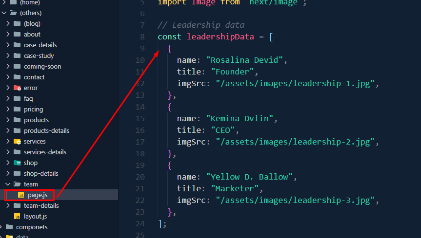

#  Welcome To Omnivus - IT solutions, digital services, and business agencies theme 

Firstly, a huge thanks for purchasing this theme, your support is truly appreciated!

This document covers the installation and use of this theme and often reveals answers to common problems and issues - read this document thoroughly if you are experiencing any difficulties. If you have any questions that are beyond the scope of this document, feel free to email at [suppot@ducor.net](mailto:__EMAIL__) Thank you so much!


## Basic

1.  After unzip the download pack, you'll found a Template Folder with all the files.
2.  You can view this Template in any browser, you can display or edit the Template without an internet connection.(May not wotrk fonts and google map).
3.  This section that will not work is the Contact Section

- **Omnivus Template**: An installable Next.js template zip file.
- **Documentation Folder**: Contains this documentation you are reading now.

Here’s an overview of the included files:
 


### ⚛️ Next.js Installation

To set up locally, follow these steps:

1. Open your terminal or command prompt.  
2. Navigate to the project folder.  
3. Run the following commands:

   ```bash
   yarn install
   yarn dev
   ```


### 🛠️ Customization

#### Change Site Title 

To change the site title, open the project in your editor and edit the `next.config.js` file or use the `Head` component in the pages where needed:


##### Method 1: Global Title
 Modify the Site Title in `next.config.js`
 
1. Open the project in your editor.
2. Edit the `next.config.js` file.
3. Update the `title` property inside the `head` configuration.


Example:

```js
// next.config.js
module.exports = {
  head: {
    title: 'My Awesome Site',  // Set the global title here
    meta: [
      {
        name: 'description',
        content: 'This is an awesome Next.js site!'  // Optional description
      },
    ],
  },
};
```


##### Method 2: Individual Pages

If you want to set a specific title for individual pages, you can use the `Head` component from `next/head`:

1. Open or create the page where you want to change the title (e.g., `pages/index.js`).
2. Import the `Head` component from `next/head`.
3. Add a `<title>` tag inside the `Head` component for each page.

Example:

```jsx
// pages/index.js
import Head from 'next/head';

export default function Home() {
  return (
    <div>
      <Head>
        <title>Home - My Awesome Site</title>  {/* Page-specific title */}
        <meta name="description" content="Welcome to the homepage of My Awesome Site!" />
      </Head>
      <h1>Welcome to My Awesome Site!</h1>
    </div>
  );
}
```


#### Update the Favicon

To update the favicon for your site, follow these steps:

1. Replace the `favicon.ico` file in the `public/` directory with your desired favicon file.
2. Next.js automatically serves the favicon from the `public/` directory, and it will be used across all pages.

File Structure:

```plaintext
public/
  favicon.ico  // Your updated favicon file
```


####  Home 1 

For **Home 1**, you can customize the following sections:

- **Banner Image**: Modify `_banner.scss` located in `public\assets\scss\`.

  

- **Services Section**: Edit `Index.jsx` in `components/LatestServicesPart/`.

  

- **Team Member Section**: Edit `Index.jsx` in `components/teamMemberPart/`.

  

- **Latest News Section**: Edit `Index.jsx` in `components/latestNewsPart/`.

  


####  Home 2 

For **Home 2**, you can modify:

- **Banner Image**: Edit `Index2.jsx` in `components/banner/`.

  

- **Services Section**: Edit `Index.jsx` in `components/whatWeDoPart/`.

  

- **FAQ Section**: Edit `Index.jsx` in `components/answersPart/`.

  

- **Latest News Section**: Edit `Index.jsx` in `components/latestNewsPart/`.

  


####  Service 

On the **Service Page**, you can customize:

- **Service Item Section**: Edit `Index.jsx` in `components/servicesItemPart/`.

  

- **Service Plans Section**: Edit `ServicesPlansPart.jsx` in `components/servicesPart/`.

  


####  Case Study 

To edit the **Case Study Page**, update `page.js` located in `src\app\(pages)\(others)\case-study/`.


####  Team

To edit the **Team Page**, update `page.js` located in `src\app\(pages)\(others)\team`.




####  blog-standard

- **Blog**: Edit `BlogSideBar.jsx` in `src\app\componets\blog\`.
  


- **Popular-feed**: Edit `BlogSideBar.jsx` in `src\app\componets\blog\`.
  


- **Categories**: Edit `BlogSideBar.jsx` in `src\app\componets\blog\`.
  


- **Tags**: Edit `BlogSideBar.jsx` in `src\app\componets\blog\`.
  


####  blog-grid

- **Blogs**: Edit `page.js` in `src\app\(pages)\(others)\(blog)\blog-grid\`.
  


####  Shop

- **Shop**: Edit `page.js` in `src\app\(pages)\(others)\shop\`.
  


####  Product

- **Product**: Edit `page.js` in `src\app\(pages)\(others)\products\`.
  


### 🏗️ Build for Production

To build the project for production, use:

```bash
yarn build
```


### 📧 Support

If you enjoy using our product, [Please Rate Us](https://themeforest.net/user/ducor). 😊


### Source and Credit

- [@fortawesome](https://fontawesome.com/)  
- [Animate.css](https://github.com/animate-css/animate.css)  
- [Axios](https://github.com/axios/axios)  
- [Bootstrap](https://getbootstrap.com/)  
- [React Bootstrap](https://react-bootstrap.github.io/)  
- [Desandro Matches Selector](https://github.com/desandro/matches-selector)  
- [Next.js](https://nextjs.org/)  
- [React](https://reactjs.org/)  
- [React Icons](https://github.com/react-icons/react-icons)  
- [React Modal Video](https://github.com/appleple/react-modal-video)  
- [React Slick](https://github.com/akiran/react-slick)  
- [React Toastify](https://github.com/fkhadra/react-toastify)  
