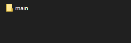
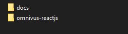
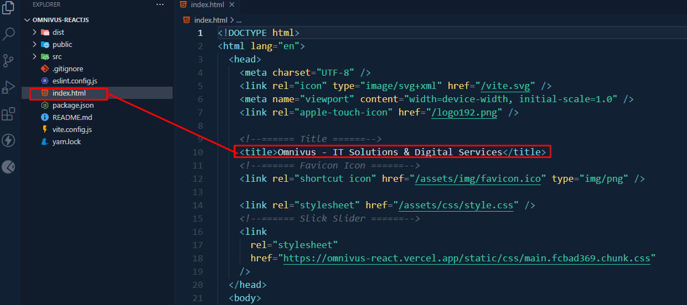
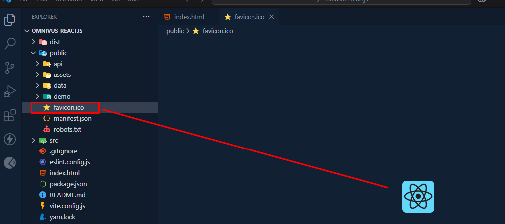

# Omnivus  

Omnivus is a cutting-edge React application designed for **IT solutions, digital services, and business agencies**. This project is fully responsive, feature-packed, and customizable for any modern IT-related business.  

---

### ⚙️ Requirements  

Ensure your system meets the following requirements to install and set up this template properly:  
- **Node.js** installed on your system.  
- **Yarn** for managing dependencies.  

---

### 🚀 Quick Start Guide  

#### 📥 Install Dependencies  

You need to install the required packages. Run the following command from the root of your project:  
```bash
yarn install
```

#### Start the development server

Run yarn dev for a dev server. Navigate to http://localhost:5173/ . The app will automatically reload if you change any of the source files. 
```bash
yarn dev
```

### What's Included
After purchasing __Omnivus__ template on themeforest.net with your envato account, go to your download page. You can choose to download __Omnivus__ template only (Installable React template) or the entire __Omnivus__ template.After extract the package you will find following this files: 


# test




#### purchasing our template
---

| 📦 **Omnivus**          | **An Installable React template zip file.** This file you need to upload.    |
|--------------------------|-----------------------------------------------------------------------------|
| 📄 **Documentation**     | **This folder contains the documentation you are reading now.** 🙂         |

---

### ⚛️ React Installation  
Please follow the instructions to see how you can install React on your hosting: 

 For Localhost Setup -
> [!IMPORTANT]
> 
> - Open your command prompt.
>   - `yarn install`
>   - `yarn dev`


### Change Site Title

To change your Site title and Favicon open the Omnivus in your editor and go to the location by following screenshot which are given bellow.



### Change Favicon

To change your Site Favicon by following screenshot
> [!NOTE]  
> ⭐`favicon.ico` is placed in the `public/` directory




### How to change banner image


#### Build the project for production

```bash
yarn build
```

#### Remove node_modules

```bash
yarn clean
```

###### Support ? _EMAIL_

If you like our product. [Please Rate Us](https://themeforest.net/user/ducor)
