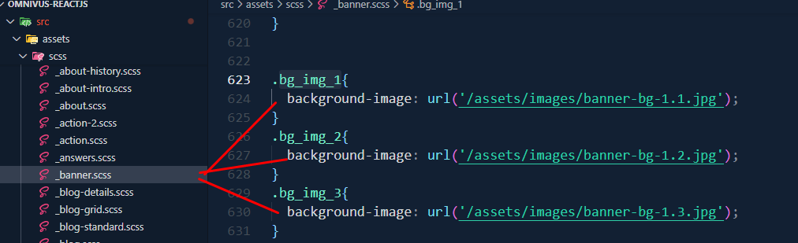

#  Welcome To Omnivus - IT solutions, digital services, and business agencies theme 

Firstly, a huge thanks for purchasing this theme, your support is truly appreciated!

This document covers the installation and use of this theme and often reveals answers to common problems and issues - read this document thoroughly if you are experiencing any difficulties. If you have any questions that are beyond the scope of this document, feel free to email at [__EMAIL__](mailto:__EMAIL__) Thank you so much!

## Basic

1.  After unzip the download pack, you'll found a Template Folder with all the files.
2.  You can view this Template in any browser, you can display or edit the Template without an internet connection.(May not wotrk fonts and google map).
3.  This section that will not work is the Contact Section

- **Omnivus Template**: An installable React.js template zip file.
- **Documentation Folder**: Contains this documentation you are reading now.

Here’s an overview of the included files:

  

### ⚛️ React Installation  

To set up locally, follow these steps:  

1. Open your terminal or command prompt.  
2. Navigate to the project folder.  
3. Run the following commands:
```bash
   yarn install
   yarn dev
```

### 🛠️ Customization  

### Title and Favicon  

To change the site title, open the project in your editor and follow this screenshot:  

  

To update the favicon, replace the `favicon.ico` file in the `public/` directory as shown:  

  

#### Home 1   

For **Home 1**, you can customize the following sections:  

- **Banner Image**: Modify `_banner.scss` located in `src/assets/scss/`.  
  

- **Services Section**: Edit `Index.jsx` in `src/components/LatestServicesPart/`.  

    

- **Team Member Section**: Edit `Index.jsx` in `src/components/teamMemberPart/`.  

    

- **Latest News Section**: Edit `Index.jsx` in `src/components/latestNewsPart/`.  

    

###@ Home 2   

For **Home 2**, you can modify:  

- **Banner Image**: Edit `Index2.jsx` in `src/components/banner/`.  

    

- **Services Section**: Edit `Index.jsx` in `src/components/whatWeDoPart/`.  

    

- **FAQ Section**: Edit `Index.jsx` in `src/components/answersPart/`.  

    

- **Latest News Section**: Edit `Index.jsx` in `src/components/latestNewsPart/`.  

    

#### Service   

On the **Service Page**, you can customize:  

- **Service Item Section**: Edit `Index.jsx` in `src/components/servicesItemPart/`.  

    

- **Service Plans Section**: Edit `ServicesPlansPart.jsx` in `src/components/servicesPart/`.  

    

#### Case Study   

To edit the **Case Study Page**, update `index.jsx` located in `src/pages/case-study/`.  

  


####  Team

To edit the **Team Page**, update `Index.js` located in `src\pages\team`.


####  blog-standard

- **Blog**: Edit `BlogSideBar.jsx` in `src\componets\blog\`.
  


- **Popular-feed**: Edit `BlogSideBar.jsx` in `src\componets\blog\`.
  


- **Categories**: Edit `BlogSideBar.jsx` in `src\componets\blog\`.
  


- **Tags**: Edit `BlogSideBar.jsx` in `src\componets\blog\`.
  


####  blog-grid

- **Blogs**: Edit `blog-grid.jsx` in `src\pages\blog\`.
  


####  Shop

- **Shop**: Edit `index.js` in `src\pages\shop\`.
  


####  Product

- **Product**: Edit `index.js` in `src\pages\products\`.
  


### 🏗️ Build for Production  

To build the project for production, use:  

```bash
yarn build
```

### 🧹 Clean Up  

To remove the `node_modules` folder and clean your project, run:  

```bash
yarn clean
```

### 📧 Support  

If you enjoy using our product, [Please Rate Us](https://themeforest.net/user/ducor). 😊  

### Source and Credit

- [@fortawesome](https://fontawesome.com/)  
- [Animate.css](https://github.com/animate-css/animate.css)  
- [Axios](https://github.com/axios/axios)  
- [Bootstrap](https://getbootstrap.com/)  
- [React Bootstrap](https://react-bootstrap.github.io/)  
- [Desandro Matches Selector](https://github.com/desandro/matches-selector)  
- [React](https://reactjs.org/)  
- [React Icons](https://github.com/react-icons/react-icons)  
- [React Modal Video](https://github.com/appleple/react-modal-video)  
- [React Slick](https://github.com/akiran/react-slick)  
- [React Toastify](https://github.com/fkhadra/react-toastify)  

