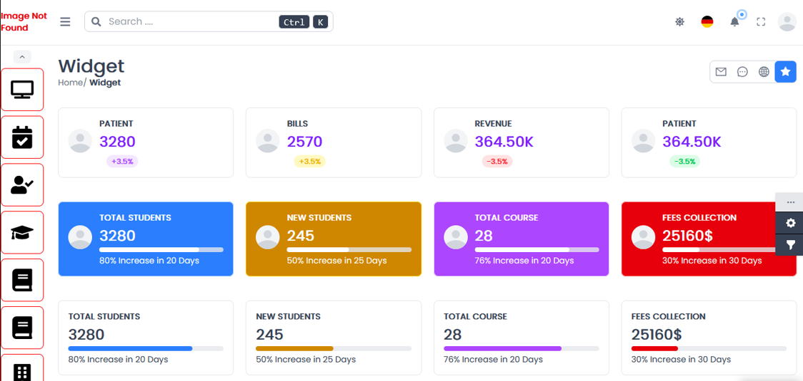

# RuEdu Admin Dashboard


A modern admin dashboard template built with Vite, React, TypeScript, and Ducor UI components.



Firstly, a huge thanks for purchasing this theme, your support is truly appreciated!

This document covers the installation and use of this theme and often reveals answers to common problems and issues - read this document thoroughly if you are experiencing any difficulties. If you have any questions that are beyond the scope of this document, feel free to email at [suppot@ducor.net](mailto:__EMAIL__) Thank you so much!

## Basic

1.  After unzip the download pack, you'll found a Template Folder with all the files.
2.  You can view this Template in any browser, you can display or edit the Template without an internet connection.(May not wotrk fonts and google map).
3.  This section that will not work is the Contact Section

- **RuEdu Template**: An installable React.js template zip file.
- **Documentation Folder**: Contains this documentation you are reading now.

Here’s an overview of the included files:

  

####  Project Installation 
Ensure that you have Node.js (v16 or higher) installed on your system. To verify your Node.js version, run the following command:
```bash
node -v
```
You also need pnpm installed globally. If you do not have pnpm, install it using the following command:
```bash
pnpm install -g pnpm
```
Verify Yarn installation with:
```bash
pnpm -v
```
1.  Open your terminal or command prompt.
2.  Navigate to the project folder.
   ```bash
   cd ru-edu
   ``` 
3.  Run the following commands to set up the project:

  Yarn is an established open-source package manager used to manage dependencies in JavaScript projects. It assists with the process of 
  installing, updating, configuring, and removing packages dependencies, eventually helping you reach your objectives faster with fewer 
  distractions.

 > **Note**: Unlike most other package managers, which typically defer to pnpm for non-install-related commands, pnpm reimplements all 
 commands, so as to have full control over our developer experience and stability. 
 **Install Dependencies:**
 ```bash
 pnpm install
 ```
 **Start Development Server:** This command starts the development server, enabling you to preview changes live in your browser. By 
     default, the server runs at `http://localhost:3000/`.
 ```bash
    pnpm run dev
  ```

####  Performance
- **Vite-powered** for instant hot module replacement
- **Code splitting** for optimized loading
- **Production-ready** builds with minification


###  Build for Production  

To build the project for production, use:  

```bash
pnpm run build
```

####  Clean Up  

To remove the `node_modules` folder and clean your project, run:  

```bash
pnpm run clean
```

###  Support  

If you enjoy using our product, [Please Rate Us](https://themeforest.net/user/ducor). 😊  

###  Sources & Credits

#### Core Libraries
- [React](https://react.dev) - JavaScript library for building user interfaces
- [Tailwind CSS](https://tailwindcss.com) - Utility-first CSS framework
- [Axios](https://axios-http.com) - Promise-based HTTP client
- [React Router](https://reactrouter.com) - Client-side routing

#### UI Components
- [Ducor UI](https://ducorui.com) - Internal component library (`@ducor/react`, `@ducor/hooks`, `@ducor/form`)
- [Headless UI](https://headlessui.com) - Unstyled accessible components
- [React Icons](https://react-icons.github.io/react-icons) - Icon library
- [Sonner](https://sonner.emilkowal.ski) - Toast notifications

#### Data Visualization
- [Chart.js](https://www.chartjs.org) + [React ChartJS 2](https://react-chartjs-2.js.org) - Interactive charts
- [Recharts](https://recharts.org) - Composible charting library

#### Calendar
- [FullCalendar](https://fullcalendar.io) - Full-featured calendar system

##3# Utilities
- [Tailwind Plugins](https://tailwindcss.com/docs/plugins) - Official Tailwind extensions:
  - `@tailwindcss/forms`
  - `@tailwindcss/typography`
  - `@tailwindcss/aspect-ratio`
  - `@tailwindcss/container-queries`
- [Tailwind Merge](https://github.com/dcastil/tailwind-merge) - Conditional Tailwind class merging

#@## Internationalization
- [React i18next](https://react.i18next.com) - Internationalization framework

##@# Development Tools
- [Prettier](https://prettier.io) - Code formatter
- [Prop Types](https://github.com/facebook/prop-types) - Runtime type checking

#@# 📜 License
All third-party libraries are used under their respective open-source licenses.
